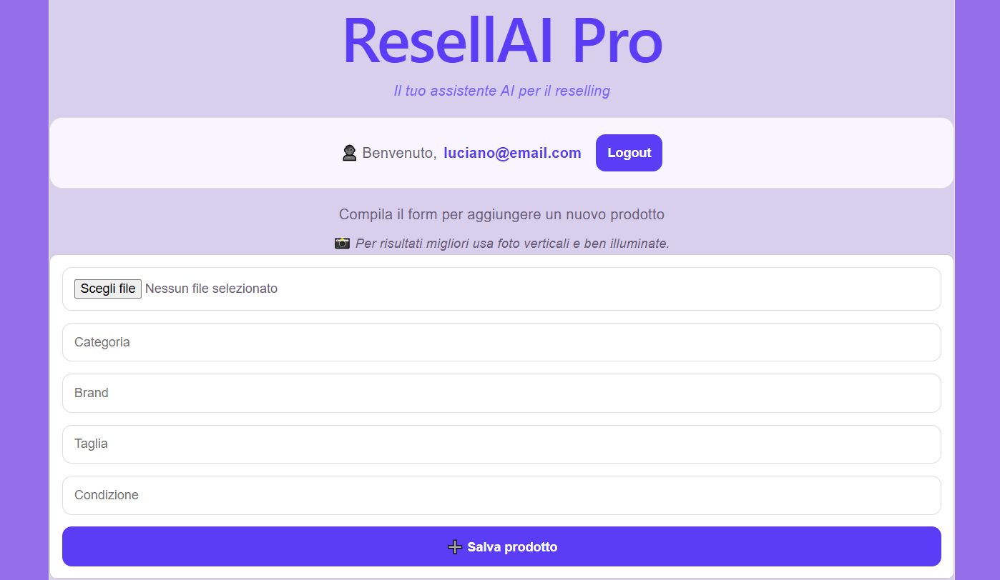
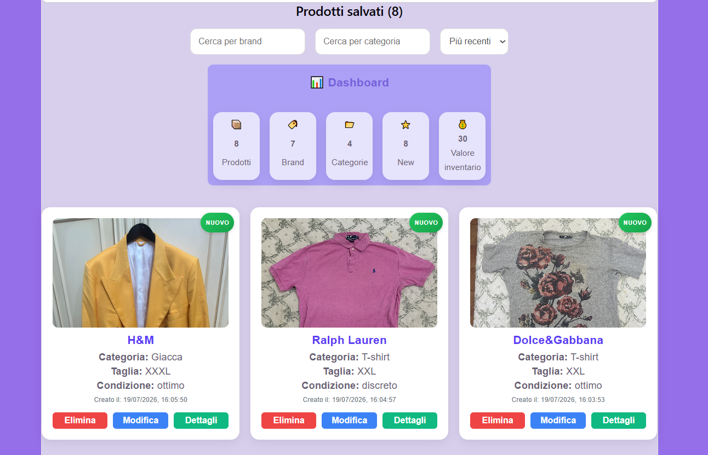
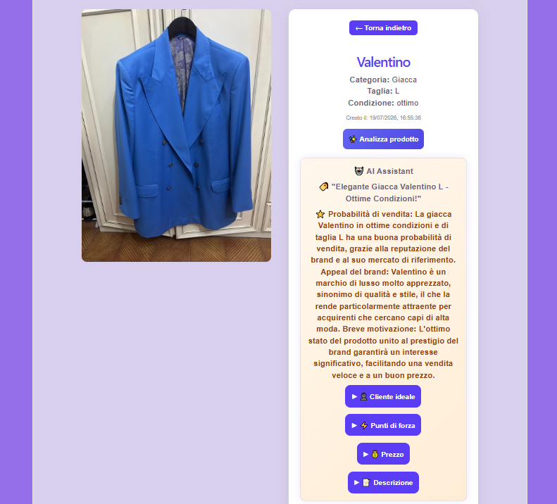

# 🦁 ResellAI Pro

> Il tuo assistente AI per il reselling di abbigliamento usato.


## 📖 Descrizione

ResellAI Pro è un'applicazione Full Stack progettata per aiutare gli utenti nella vendita di capi di abbigliamento usati attraverso il supporto dell'intelligenza artificiale.

L'utente può inserire le informazioni del prodotto, caricare un'immagine e ottenere una valutazione AI completa, comprensiva di prezzo suggerito, fascia di prezzo, descrizione ottimizzata, punti di forza e cliente ideale.

Il progetto è stato sviluppato con React, Node.js, Express, Supabase e OpenAI API per offrire un'esperienza semplice, moderna e intuitiva.


## ✨ Funzionalità

- 🤖 Analisi AI dei capi di abbigliamento usati.
- 💰 Generazione di un prezzo suggerito e di una fascia di prezzo.
- 📝 Creazione automatica di una descrizione ottimizzata per la vendita.
- 🎯 Individuazione del cliente ideale.
- ⭐ Evidenziazione dei principali punti di forza del prodotto.
- 📷 Caricamento e gestione delle immagini.
- 🔐 Autenticazione utente.
- 📂 Storico delle valutazioni salvate.
- 🔍 Ricerca e filtro dei prodotti.
- 📱 Interfaccia moderna e responsive.


## 🛠️ Tecnologie utilizzate

### Frontend
- React
- JavaScript (ES6+)
- Vite
- CSS3

### Backend
- Node.js
- Express.js

### Database & Storage
- Supabase
- PostgreSQL
- Supabase Storage

### Intelligenza Artificiale
- OpenAI API (GPT)

### Strumenti di sviluppo
- Git
- GitHub
- Visual Studio Code


## 🏗️ Architettura del progetto

ResellAI Pro è organizzato secondo un'architettura Full Stack, composta da un frontend sviluppato con React, un backend realizzato con Node.js ed Express, un database PostgreSQL gestito tramite Supabase e l'integrazione delle API OpenAI per l'analisi AI dei prodotti.

Utente
   │
   ▼
Frontend (React)
   │
   ▼
Backend (Node.js + Express)
   │
   ├────────────► OpenAI API
   │
   ▼
Supabase
(Database + Storage)


## 📸 Screenshot

### Pre-login


### Add product


### Dashboard


### AI analysis



## 🚀 Installazione
```bash
1. Clona il repository.

git clone ...

2. Entra nella cartella del progetto.

cd ...

3. Installa le dipendenze.

npm install

4. Configura le variabili d'ambiente.
5. Avvia il progetto.

npm run dev
```

## ⚙️ Variabili d'ambiente
```env
VITE_BACKEND_URL=

OPENAI_API_KEY=

SUPABASE_URL=

SUPABASE_ANON_KEY=
```
## 🌐 API

ResellAI Pro utilizza le API di OpenAI per analizzare i prodotti e generare automaticamente:

- Prezzo suggerito
- Fascia di prezzo
- Cliente ideale
- Punti di forza
- Descrizione ottimizzata per la vendita

### OpenAI API

Utilizzata per generare automaticamente l'analisi AI dei prodotti.

### Backend API

- GET /prodotti
- POST /valuta
- PUT /prodotti/:id
- DELETE /prodotti/:id


## 🔮 Sviluppi futuri

- [ ] Implementare una chat AI personalizzata.
- [ ] Migliorare ulteriormente la qualità delle analisi AI.
- [ ] Aggiungere statistiche e dashboard personali.
- [ ] Consentire il caricamento di più immagini per prodotto.
- [ ] Implementare notifiche e preferiti.
- [ ] Migliorare ulteriormente l'interfaccia utente e l'esperienza d'uso.
- [ ] Migliorare continuamente il progetto attraverso nuove funzionalità e ottimizzazioni.


## 👨‍💻 Autore

**Luciano Pacini**

Sviluppatore Full Stack appassionato di React, Node.js e Intelligenza Artificiale.

Credo nell'apprendimento continuo, nella cura dei dettagli e nella realizzazione di applicazioni moderne, intuitive e utili.

Questo progetto rappresenta una tappa importante del mio percorso di crescita come sviluppatore e continuerà a evolversi nel tempo.


